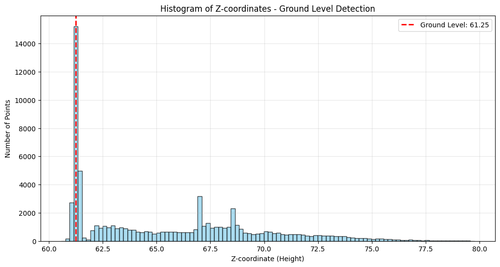
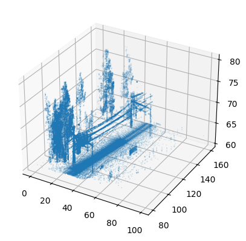
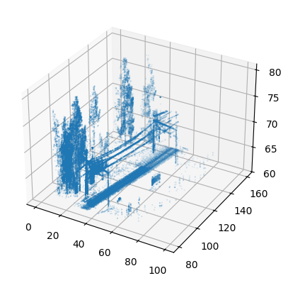
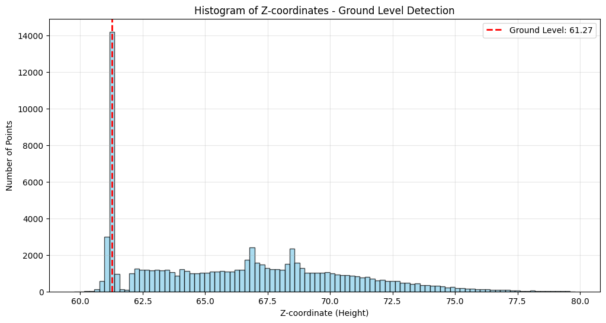
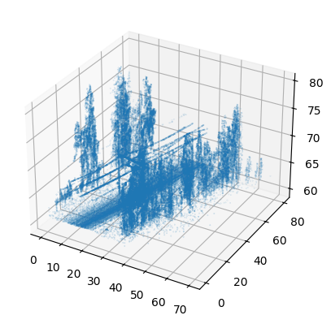
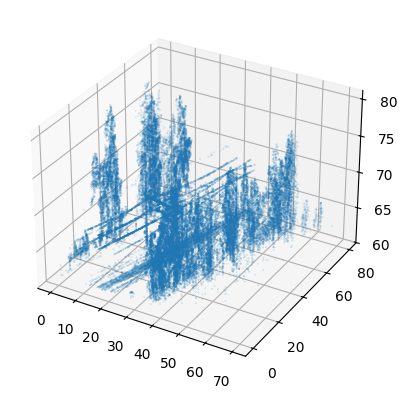

# Task 1 (3) for dataset 1
## Ground level identification using histogram

  

The ground level is at z = 61.24968500000003 for dataset 1. Here for plotting the histogram a bin size of 100 is considered. The idea was to pick the height at which maximum number of points reside. 

## Point cloud visualization with and without ground level

  <table>
    <tr>
      <td width="400">
        
        
Point cloud visualization with ground level from dataset 1.

      </td>
      <td width="400">
        
        
Point cloud visualization without ground level from dataset 1.

      </td>
    </tr>
  </table>

## Point cloud visualization without ground level

# Task 1 (3) for dataset 2
## Ground level identification using histogram

  

The ground level is at z = 61.26545 for dataset 2. Here for plotting the histogram a bin size of 100 is considered. The idea was to pick the height at which maximum number of points reside. 

## Point cloud visualization with and without ground level

  <table>
    <tr>
      <td width="400">
        
        
Point cloud visualization with ground level from dataset 2.

      </td>
      <td width="400">
        
        
Point cloud visualization without ground level from dataset 2.

      </td>
    </tr>
  </table>

